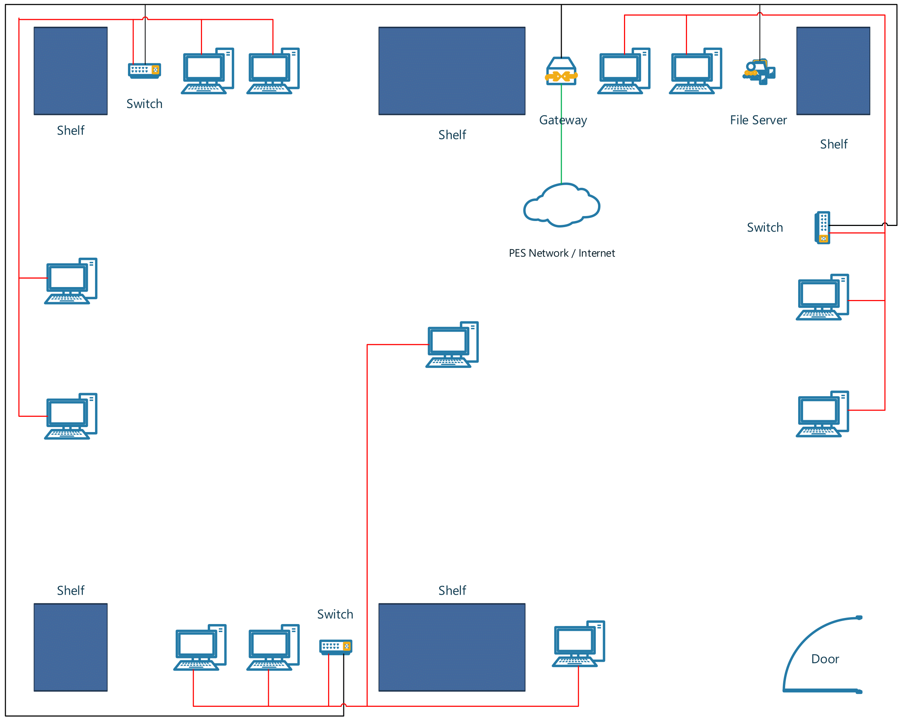

 Documentation of the Network Isolation Setup

December 2017

# Introduction
This document explains our approach taken to ensure that the experiments carried out as part of the lab’s research activity remains isolated to the lab while still connected to the PES University intranet. This involved designing the network layout and the setup of a local network of VMs and LAN-WAN isolation through a proxy that runs on [OPNSense](https://opnsense.org/), an open source firewall.

# Network Layout
Refer to the following diagram: 

- 3 switches – each connecting 4 computers. All the computers are on the same LAN.
- Switches are in turn connected to the PES network through the gateway, running OPNSense
(currently running on a VM as the PC has not yet arrived)
- Computers can be addressed on the network through their hostnames (same as the
computer names).

Note: SHOULD NOT loop the connection at the switch diagonally opposite to the door (by connecting the unconnected Ethernet cable to the switch).

# Network Isolation
Achieved through a router OS – OPNSense with built-in firewall capabilities. LAN-WAN isolation achieved through a proxy, that is running on OPNSense. OPNSense is running on a VM in Hammerhead. An added benefit is the caching on the router OS which is being used by all other computers on the LAN.

Firewall rules for the proxy:
- Block LAN to WAN traffic
- Block WAN to LAN traffic
- Allow LAN to WAN traffic through the proxy (port 3128 on Hammerhead)
- Allow WAN to LAN traffic through the proxy (port 3128 on Hammerhead)
- Allow LAN to LAN traffic

These rules work like a filter - a packet can be stopped at any level. They ensure that the computers can access the WAN only when connected through the proxy, without compromising intra-LAN communications.

Yet to implement LANs for the VMs (and therefore the VM LAN - PC LAN isolation) - Virtual network of VMs connected to the main LAN through a virtual bridge (can be implemented by running OPNSense on a VM).

File Server is yet to arrive – will host a Samba/NFS/FTP server for file sharing and Local Git server.
Currently able to achieve speeds up to 11MB/s on the network.

# Virtual Machines
Configured [virt-manager](https://virt-manager.org/) (UI built on top of KVM) and tested out a couple of virtual machines. It is easy to use and provides necessary networking options like bridging the VM on to the LAN. Yet to remove other previously set up virtualization tools that were installed on several computers.

# Systems Management
ClusterSSH – can simultaneously SSH into all hosts on the LAN, opening an administration console in each of them allowing for command sharing.
Has been setup and tested from Angel.
Allows us to mass deploy tools and software simultaneously to all computers from a single admin computer via a terminal.
